# MPSConnect — Authentication & Calculators Flow Diagrams

Open this file in VS Code / Cursor with a Mermaid preview extension, or paste diagrams into [mermaid.live](https://mermaid.live).

---

## 1. App bootstrap (Splash → Home or Onboarding)

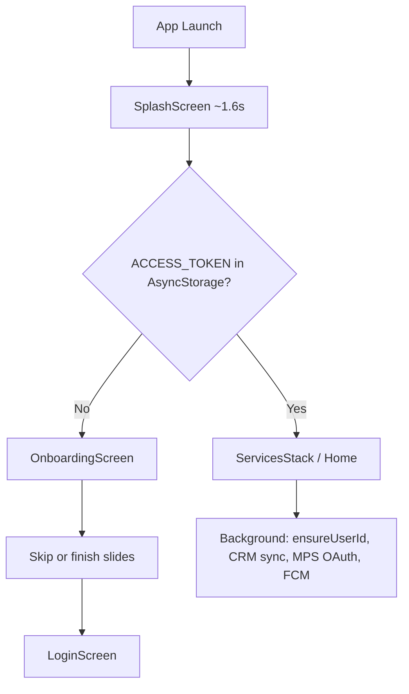

---

## 2. Authentication — full navigation map

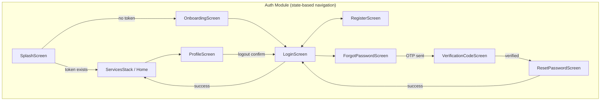

---

## 3. Login sequence (mobile + API + MPS OAuth)

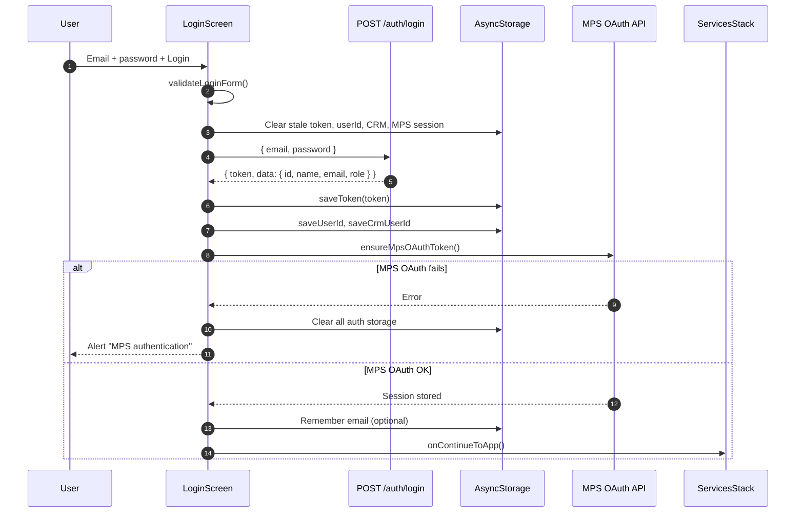

---

## 4. Register sequence

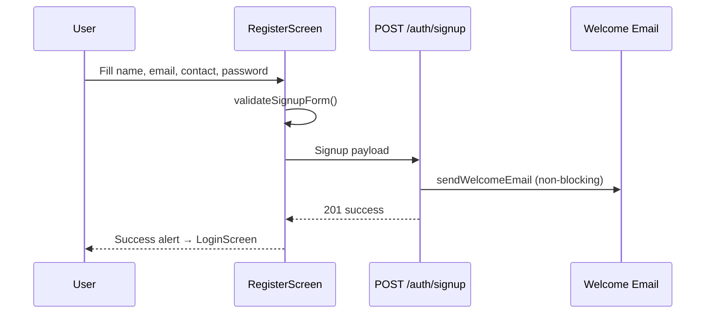

---

## 5. Forgot password + OTP + reset

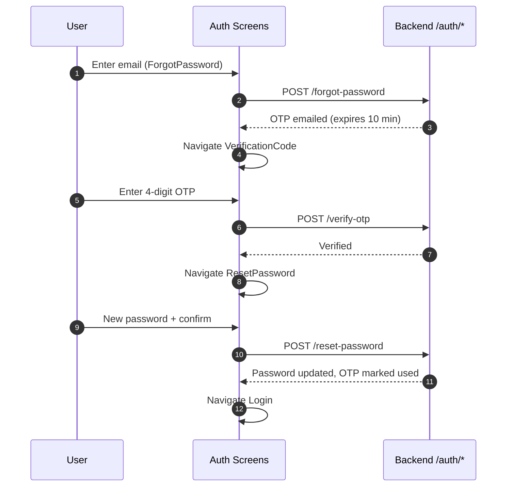

---

## 6. Backend auth API map

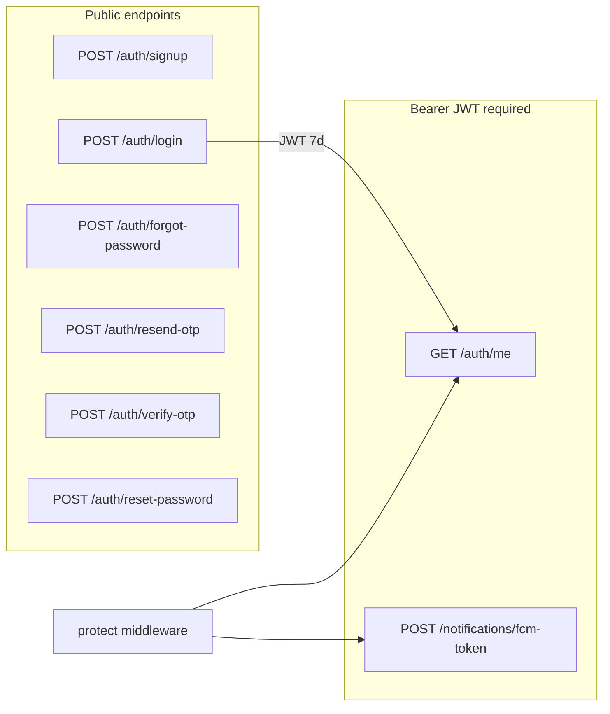

---

## 7. JWT protect middleware flow

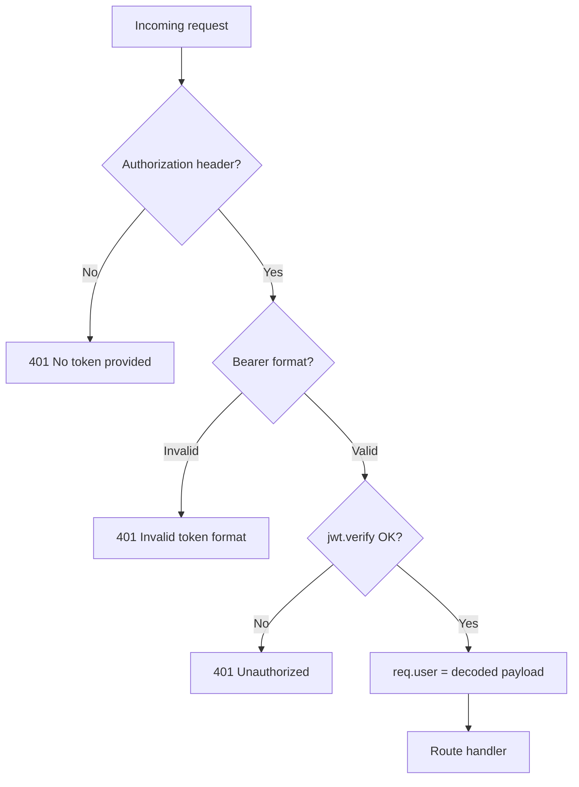

---

## 8. Logout flow

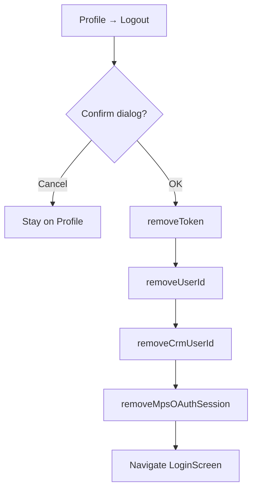

---

## 9. PlanWealth calculators — navigation map

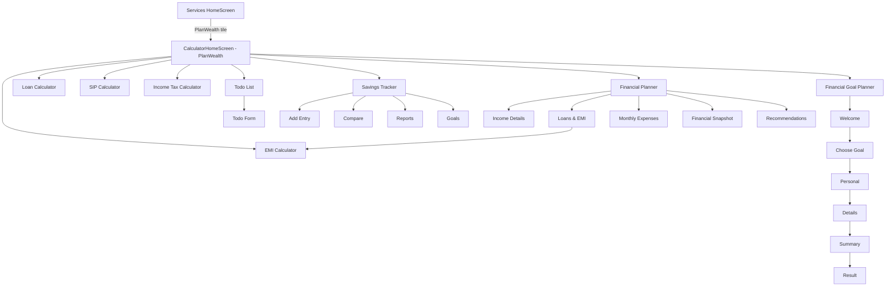

---

## 10. EMI calculator — data flow

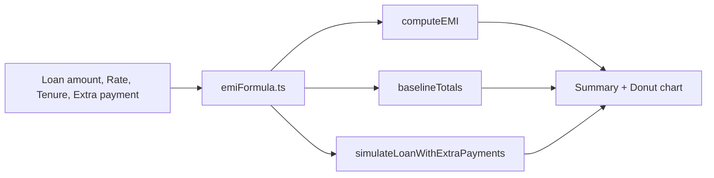

---

## 11. Financial planner — first visit flow

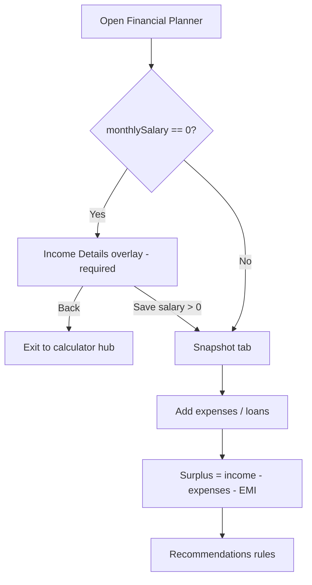

---

## 12. Savings tracker — entry aggregation

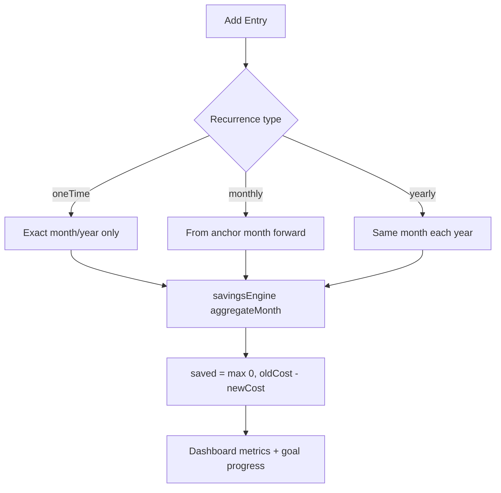

---

## 13. Financial goal wizard

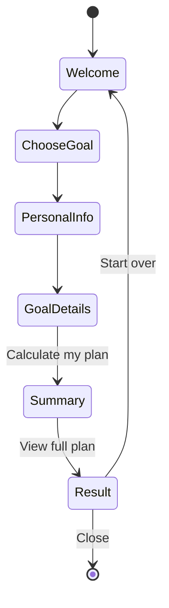

---

## 14. Test execution order (recommended)

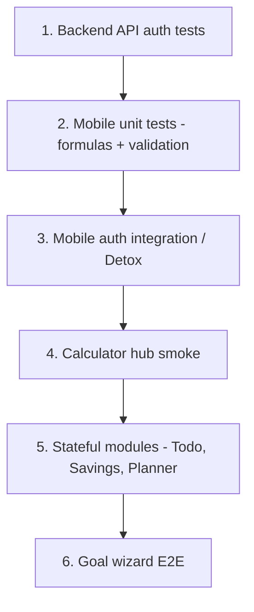
